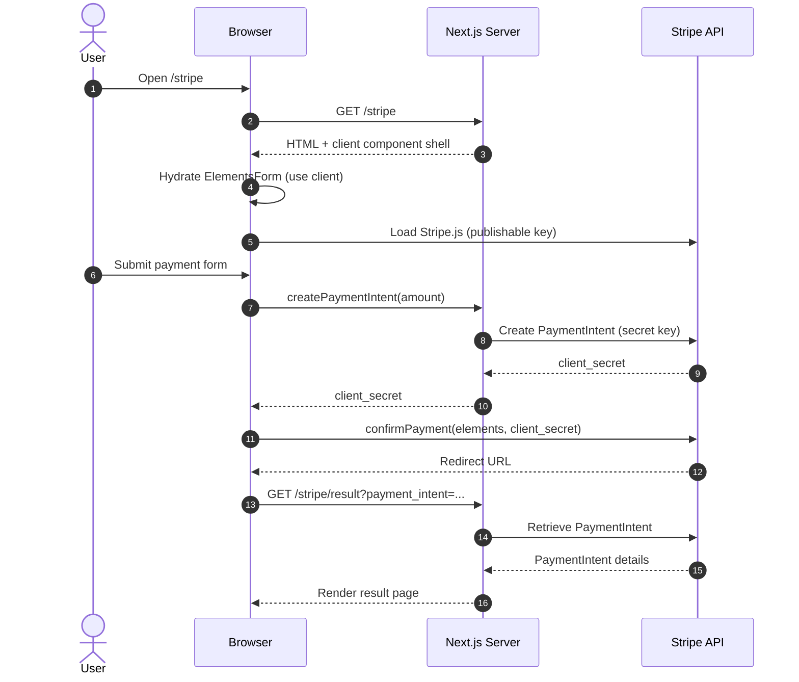

# Stripe フロー: サーバーとブラウザの役割

このドキュメントでは、`@app/stripe` の流れで「サーバーで実行されるもの」と「ブラウザで実行されるもの」を整理します。

## どこで実行されるか

サーバー（Next.js / Node）:
- `app/stripe/page.tsx`: Server Component が初期 HTML を生成。
- `app/actions/stripe.ts`: Server Action がシークレットキーで PaymentIntent を作成。
- `lib/stripe.ts`: `server-only` の Stripe SDK インスタンス（`STRIPE_SECRET_KEY` を使用）。
- `app/stripe/result/page.tsx`: PaymentIntent を取得して結果を描画する Server Component。

ブラウザ（React + Stripe.js）:
- `app/components/ElementsForm.tsx`: Client Component が Stripe.js を読み込みフォーム処理。
- Stripe Elements UI と `stripe.confirmPayment(...)` はブラウザで実行。

## 手順の流れ

1. サーバーが `app/stripe/page.tsx` をレンダリングし、HTML を返す。
2. ブラウザが `app/components/ElementsForm.tsx` を hydrate し、
   `NEXT_PUBLIC_STRIPE_PUBLISHABLE_KEY` で Stripe.js を読み込む。
3. フォーム送信でブラウザが `createPaymentIntent(amount)` を呼ぶ。
4. Server Action (`app/actions/stripe.ts`) がサーバーで動き、
   `lib/stripe.ts` 経由で PaymentIntent を作成する。
5. サーバーが `client_secret` をブラウザに返す。
6. ブラウザが `stripe.confirmPayment(...)` を実行して決済を完了させる。
7. Stripe が `/stripe/result?payment_intent=...` にリダイレクトする。
8. サーバーが `app/stripe/result/page.tsx` を実行し、PaymentIntent を取得して表示する。

## Mermaid 図

