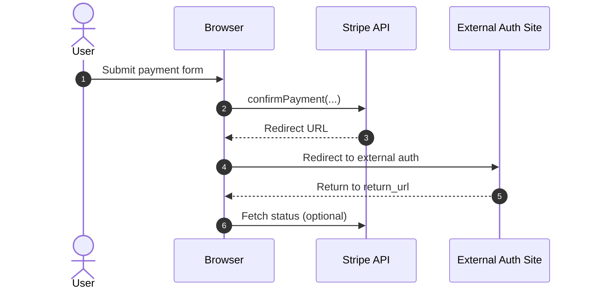
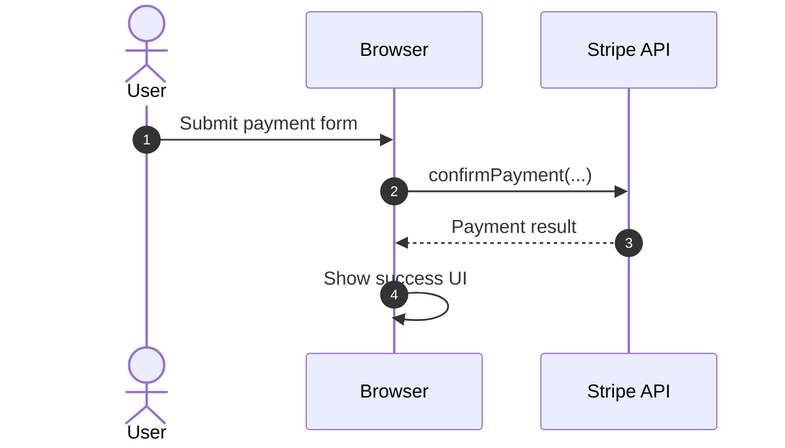
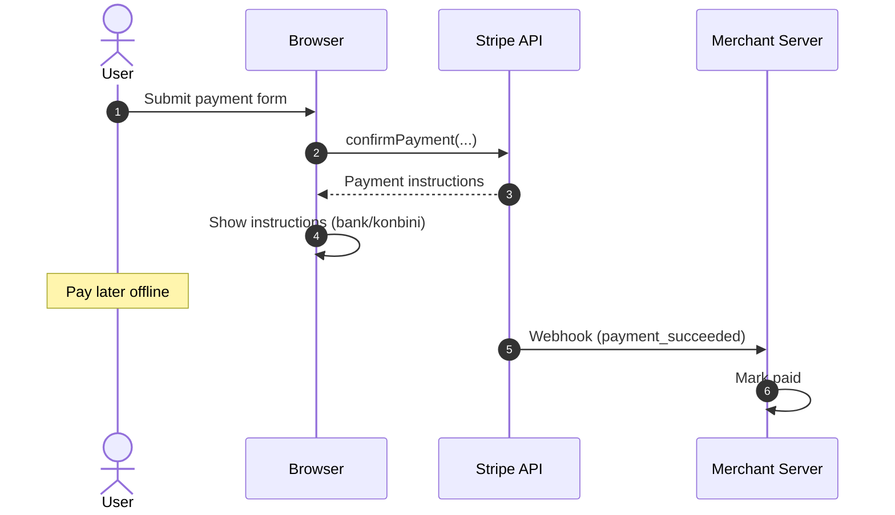

# 支払い方法の分類: リダイレクト/非リダイレクト

このドキュメントは `docs/stripe-flow.md` の補足として、支払い方法を「外部サイトで認証して戻る」か「そうでない」かで整理します。

## 外部サイトで認証して戻る（リダイレクト型）

外部の認証・決済画面に遷移し、完了後に `return_url` に戻るタイプです。

例:

- PayPay
- その他のウォレット/オンラインバンク連携系（設定や地域により変動）

挙動:

- `stripe.confirmPayment(...)` が外部URLへリダイレクト
- ユーザーが外部画面で完了/失敗
- `return_url` に戻って結果画面を表示

## 外部サイトに遷移しない（非リダイレクト型）

同一ページ内で完結するタイプです。さらに2系統に分けられます。

### 1. 即時決済（その場で完了）

ページ内の UI やブラウザ内シートで決済が完了します。

例:

- クレジットカード（3Dセキュアが必要な場合でも同一ページ内で完結することが多い）
- Apple Pay / Google Pay
- Link

挙動:

- `stripe.confirmPayment(...)` がページ内で処理
- 成功すると即時に完了状態になり、必要に応じて `return_url` に遷移

### 2. 事後支払い（案内表示→後払い）

支払い手順を表示し、ユーザーが後で支払うタイプです。

例:

- 銀行振込
- コンビニ払い

挙動:

- `stripe.confirmPayment(...)` 後に支払い手順や支払番号を表示
- 支払い完了は後日（Webhook などで確定）

## 注意点

- どの支払い方法が使えるかは「国/通貨」「Stripeの設定」「アカウント種別」で変わります。
- 実際の挙動は Stripe 側の設定や利用地域によって差があります。
- 具体的な対応方法は、対象リージョンと有効化している支払い方法が分かると整理しやすいです。
